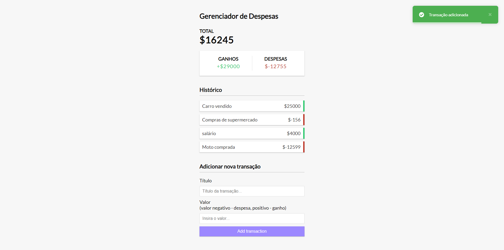

# Gerenciador de Despesas em Vue.js

<strong>Hospedado: </strong> https://gerenciador-de-despesas.netlify.app

## Project Setup

```sh
npm install
```

### Compile and Hot-Reload for Development

```sh
npm run dev
```

### Compile and Minify for Production

```sh
npm run build
```

----

## 🚧 Projeto

<p align="center">
  
</p>
